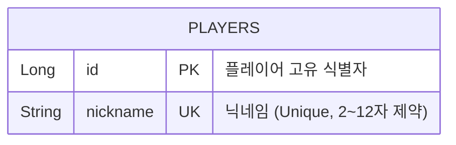
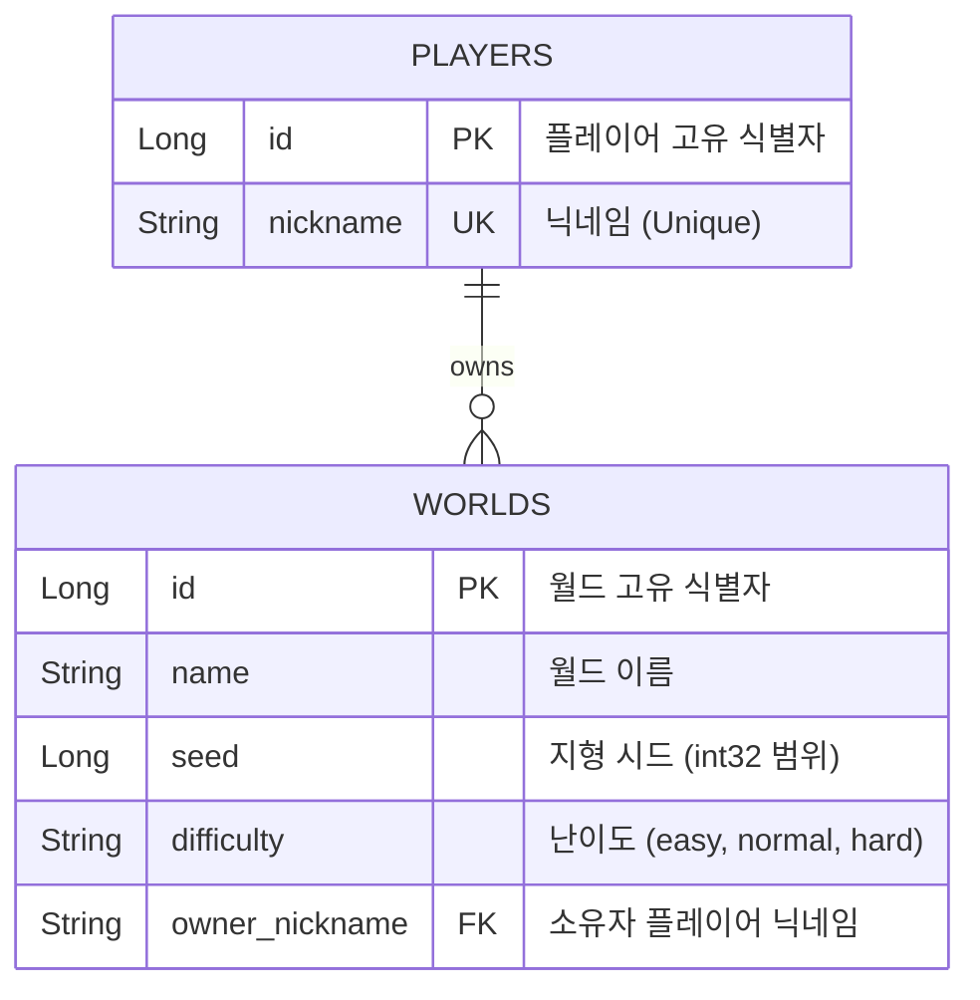

# [260916] 숙련 주차 프로젝트 발제 - WebCraft 실시간 게임 서버 구현
## 개요
- 'Docker' 환경으로 격리된 'MySQL' 데이터베이스에 모든 채팅 내역과 플레이어 데이터를 안전하게 저장하도록 연동
- 플레이어들이 여러 서버에 분산 접속하더라도 'Redis'를 통해 모든 채팅 메시지가 실시간으로 동기화되어 공유
- 'WebSocket' 방식을 통해 새로고침 없는 실시간 양방향 통신 시스템 구현

## 기술 스택
- **개발 언어 및 프레임워크:** Java 21, Spring Boot
- **데이터베이스:** MySQL (Docker)
- **캐싱 및 발행/구독:** Redis (Docker)
- **실시간 통신:** WebSocket

## 구현
### 1. 플레이어 등록 (Lv 3.)
#### 🗺️ ERD (데이터베이스 구조)


#### 📑 API 명세서
- **HTTP 메서드 / 경로:** `POST` `/players`
- **본문 형식 (Request Body):** `application/json`

| 필드명 | 타입 | 제약 조건 | 설명 |
| :--- | :--- | :--- | :--- |
| `nickname` | `string` | 2~12자, 필수 입력<br>정규식: `^[a-zA-Z0-9_]+$` | 영문 대소문자, 숫자, 밑줄(`_`)만 허용 (한글 불가) |

- **요청 데이터 예시**
```json
{
  "nickname": "steve"
}
```

- **응답 코드 목록 (Responses)**

| 상태 코드 (HTTP Status) | 설명 | 응답 본문 (Response Body) |
| :--- | :--- | :--- |
| **201 Created** | 플레이어 등록 완료 | 없음 (본문 비어있음) |
| **400 Bad Request** | 닉네임 유효성 규칙(2~12자, 정규식) 위반 | `{"error": "VALIDATION_FAILED"}` |
| **409 Conflict** | 이미 존재하는 닉네임 또는 동시 요청 충돌 발생 | `{"error": "DUPLICATE_NICKNAME"}` |

#### 🛠️ 주요 구현 특징
- **컨트롤러 검증:** `@Valid`와 `@RequestBody`를 조합하여 클라이언트가 보낸 JSON 데이터의 포맷과 정규식을 DTO 단에서 사전 검증
- **중복 처리 및 동시성 제어:** 조회를 통해 가입 여부를 먼저 체크, 같은 닉네임이 동시에 요청되어 조회 타이밍이 겹칠 경우의 예외 처리

---

### 2. 월드 생성 (Lv 4.)

게임에 입장하기 위한 월드의 목록을 조회하고, 최대 개수 제한 내에서 새로운 월드를 생성하는 API

#### 🗺️ ERD (데이터베이스 구조)
- `WORLDS` 테이블은 월드 고유 정보 및 지형 시드, 난이도를 관리하며 생성자(`owner_nickname`) 정보를 포함



#### 📑 API 명세서

##### [1] 월드 목록 조회
- **HTTP 메서드 / 경로:** `GET` `/worlds`
- **응답 코드 목록 (Responses)**

| 상태 코드 | 설명 | 응답 본문 (Response Body 예시) |
| :--- | :--- | :--- |
| **200 OK** | 월드 목록 조회 성공 (최대 3개)<br>`onlineCount`는 Redis presence에서 실시간 조회 | `[{"id": 1, "name": "내 첫 월드", "seed": -173482, "onlineCount": 3, "difficulty": "normal"}]` |
| **503 Service** | 서버 기동 직후 월드 준비 완료 전 상태 | `{"error": "WORLD_BASELINE_INITIALIZING"}` |

##### [2] 월드 생성
- **HTTP 메서드 / 경로:** `POST` `/worlds`
- **본문 형식 (Request Body):** `application/json`

| 필드명 | 타입 | 제약 조건 | 설명 |
| :--- | :--- | :--- | :--- |
| `name` | `string` | 1~30자, 필수 입력<br>공백 문자열 불가 | 생성할 월드의 이름 |
| `difficulty` | `string` | 기본값: `"normal"`<br>Enum: `easy`, `normal`, `hard` | 월드 진행 난이도 |
| `nickname` | `string` | 2~12자, 선택 입력<br>등록된 플레이어 필수 | 월드를 생성하고 소유할 플레이어 닉네임 |

- **요청 데이터 예시 (Request Body Example)**
```json
{
  "name": "내 첫 월드",
  "difficulty": "normal",
  "nickname": "steve"
}
```

- **응답 코드 목록 (Responses)**

| 상태 코드 (HTTP Status) | 설명 | 응답 본문 (Response Body) |
| :--- | :--- | :--- |
| **201 Created** | 월드 생성 완료 (서버가 signed int32 시드 지정) | `{"id": 4, "name": "내 첫 월드", "seed": -173482, "difficulty": "normal", "ownerNickname": "steve"}` |
| **400 Bad Request** | 이름 규칙 위반(`VALIDATION_FAILED`) 또는 잘못된 포맷 | `{"error": "INVALID_REQUEST_BODY"}` |
| **404 Not Found** | 요청에 포함된 `nickname`이 가입되지 않은 플레이어임 | `{"error": "PLAYER_NOT_FOUND"}` |
| **409 Conflict** | 전체 생성된 월드가 이미 최대 상한선(3개)에 도달함 | `{"error": "WORLD_LIMIT_REACHED"}` |
| **503 Service** | 서버 기동 직후 월드 준비 완료 전 상태 | `{"error": "WORLD_BASELINE_INITIALIZING"}` |

#### 🛠️ 주요 구현 특징 (Technical Points)
- **서버 기동 안전장치:** `baselineReadiness.isReady()` 검증을 통해 서버 초기화가 완료되기 전 들어오는 요청을 `503 Service Unavailable`로 안전하게 차단합니다.
- **트랜잭션 기반 동시성 원자성 보장:** `worldOperations.duringCreation()` 람다 스코프 내부에서 실행을 격리하여, 분산 서버 환경에서 여러 건의 생성 요청이 동시에 인입되더라도 `worldRepository.countRootWorlds()` 검사가 정확히 카운팅되어 `MAX_WORLDS(3개)` 상한선을 절대로 넘지 않도록 트랜잭션 동시성을 제어합니다.
- **방어적 데이터 검증:** 월드 소유자가 지정된 경우 `playerRepository.findByNickname()` 검증을 거쳐 가입되지 않은 도용 닉네임일 시 `404 PLAYER_NOT_FOUND` 예외를 즉각 발생시킵니다.
