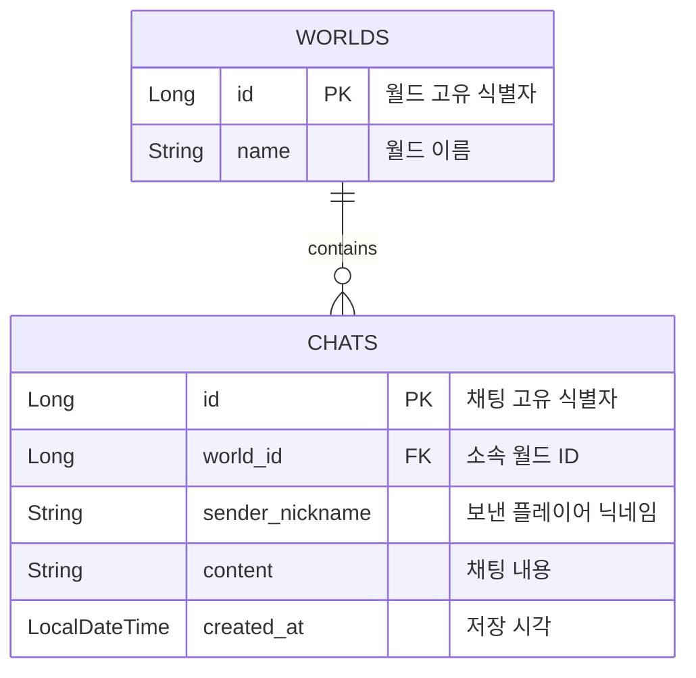
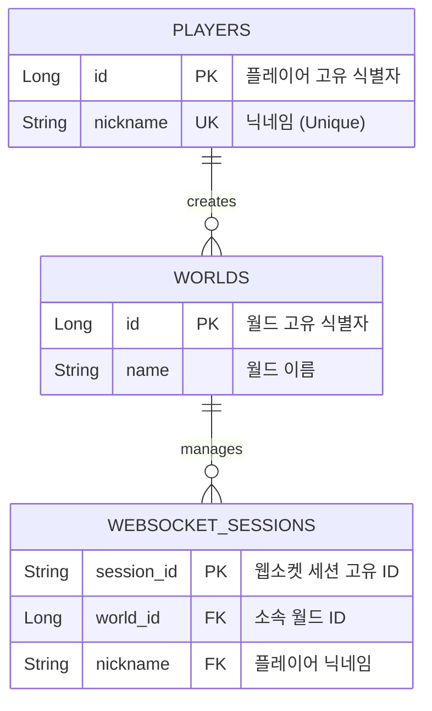
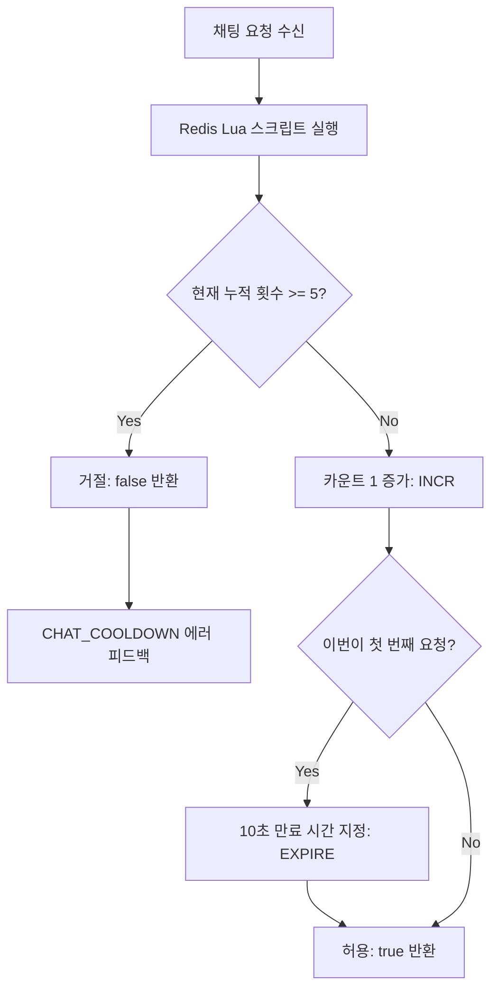
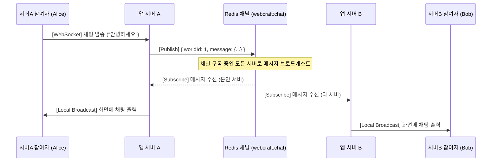

# [260916] 숙련 주차 프로젝트 발제 - WebCraft 실시간 게임 서버 구현
## 개요
- 'Docker' 환경으로 격리된 `MySQL` 데이터베이스에 모든 채팅 내역과 플레이어 데이터를 안전하게 저장하도록 연동
- 플레이어들이 여러 서버에 분산 접속하더라도 `Redis`를 통해 모든 채팅 메시지가 실시간으로 동기화되어 공유
- `WebSocket` 방식을 통해 새로고침 없는 실시간 양방향 통신 시스템 구현
- `브로드캐스팅` 방식을 통해 다수의 서버가 실시간으로 채팅 발행/구독 기능 구현

## 기술 스택
- **개발 언어 및 프레임워크:** Java 21, Spring Boot
- **데이터베이스:** MySQL (Docker)
- **캐싱 및 발행/구독:** Redis (Docker)
- **실시간 통신:** WebSocket

## 구현
### 1. 최근 채팅 조회 (Lv.5 ~ Lv.6)
월드에 처음 들어갈 때 해당 월드의 최근 대화를 불러오는 API

#### 🗺️ ERD (데이터베이스 구조)



#### 📑 API 명세서
- **HTTP 메서드 / 경로:** `GET` `/worlds/{worldId}/chats`

| 파라미터 종류 | 필드명 | 타입 | 제약 조건 | 설명 |
| :--- | :--- | :--- | :--- | :--- |
| **Path** | `worldId` | `integer <int64>` | 필수 입력 | 월드의 고유 식별자<br>숫자가 아니면 400 VALIDATION_FAILED |
| **Query** | `limit` | `integer` | 기본값: `50`<br>선택 입력 | 가져올 최대 건수<br>1 미만이나 100 초과는 1~100으로 보정, 숫자가 아니면 400 |

- **응답 데이터 예시 (200 OK)**
```json
[
  {
    "sender": "steve",
    "content": "안녕하세요!",
    "createdAt": "2026-09-22T09:41:00"
  }
]
```

- **응답 코드 목록 (Responses)**

| 상태 코드 (HTTP Status) | 설명 | 응답 본문 (Response Body) |
| :--- | :--- | :--- |
| **200 OK** | 오래된 순서의 채팅 목록 반환 | `[{"sender": "string", "content": "string", "createdAt": "string"}]` |
| **400 Bad Request** | `worldId` 또는 `limit`이 숫자가 아님 | `{"error": "VALIDATION_FAILED"}` |
| **404 Not Found** | 요청에 포함된 `worldId`가 존재하지 않는 월드임 | `{"error": "WORLD_NOT_FOUND"}` |

#### 🛠️ 주요 구현 특징
- **최신순 정렬:** DB에서 최신 대화가 먼저 추출되도록 페이징(`PageRequest`) 조회를 수행, 반환 시 역정렬
- **성능 최적화:** 읽기 전용 트랜잭션(`@Transactional(readOnly = true)`)을 통해 조회 성능을 최적화하고 엔티티 변경 감지

---

### 2. WebSocket 연결 및 월드별 세션 관리 (Lv.7 ~ Lv.9)
플레이어가 특정 월드에 진입하여 실시간 게임 환경에 참여할 수 있도록 웹소켓 연결을 수립하고, 월드별 클라이언트 세션을 관리

#### 🗺️ ERD (데이터베이스 구조)
- 웹소켓 연결 핸드셰이크 시점에 `PLAYERS` 및 `WORLDS` 테이블을 조회하여 실제 등록된 데이터인지 검증



#### 📑 API 명세서
- **연결 프로토콜 / 경로:** `ws://localhost:8080/ws/worlds/{worldId}?nickname={nickname}`
- **프레임 형식 (Message Type):** `Text (JSON String)`

| 파라미터 종류 | 필드명 | 타입 | 제약 조건 | 설명 |
| :--- | :--- | :--- | :--- | :--- |
| **Path** | `worldId` | `integer <int64>` | 필수 입력 | 입장할 월드의 고유 식별자 (월드 목록/생성 응답에서 받은 ID) |
| **Query** | `nickname` | `string` | 필수 입력 | `POST /players`로 사전에 등록한 플레이어의 닉네임 |

- **웹소켓 연결 상태 및 종료 코드 목록 (Handshake & Close Codes)**

| 상태/종료 코드 | 구분 | 발생 상황 및 설명 | 비고 / 처리 결과 |
| :--- | :--- | :--- | :--- |
| **101 Switching Protocols** | HTTP Status | 핸드셰이크 성공 및 웹소켓 커넥션 수립 완료 | 전이중 실시간 양방향 통신 시작 |
| **403 Forbidden** | HTTP Status | 허용되지 않은 오리진(Origin)으로부터의 접근 요청 | 핸드셰이크 단계에서 즉시 거절 |
| **503 Service Unavailable** | HTTP Status | 서버가 가동 직후이며 아직 월드 준비가 완료되지 않은 상태 | 핸드셰이크 단계에서 즉시 거절 |
| **4000** | Close Code | `nickname` 파라미터가 누락되었거나 가입되지 않은 플레이어인 경우 | 연결 수립 직후 세션 강제 해제 |
| **4001** | Close Code | 해당 `worldId`가 존재하지 않거나 접속할 수 없는 월드인 경우 | 연결 수립 직후 세션 강제 해제 |
| **4002** | Close Code | 동일 월드 내에 동일 닉네임을 사용하는 세션이 이미 존재할 경우 | 새로운 연결만 즉시 해제 (기존 연결 유지) |
| **1000** | Close Code | 정상적인 클라이언트의 퇴장 또는 서버 종료로 인한 해제 | 정상 종료 처리 |

#### 🛠️ 주요 구현 특징
- **핸드셰이크 인터셉터를 통한 사용자 식별:** 웹소켓 연결 수립 전(`beforeHandshake`) URL 경로 변수(`worldId`)와 쿼리 파라미터(`nickname`)를 추출하고, 검증된 정보를 세션의 독립된 속성 공간(`attributes`)에 `ATTR_NICKNAME`, `ATTR_WORLD_ID` 키로 바인딩하여 세션 단위 분기 처리가 가능하도록 인프라 구축
- **인터셉터 등록:** `@EnableWebSocket` 환경 하에서 지정된 경로(`/ws/worlds/{worldId}`)에 핸들러와 구현된 인터셉터를 등록하고, 보안 처리를 위한 CORS 허용 패턴(`setAllowedOriginPatterns`) 적용
- **월드별 세션 관리:** 다중 스레드 환경에서 안전하도록 `ConcurrentHashMap`과 계층적 구조(`Map<Long, ConcurrentHashMap<String, Entry>>`)를 사용, 월드 입장 시 `putIfAbsent` 원자적 연산을 활용해 중복 자원 등록을 방지

---

### 3. Redis 접속 상태 관리 및 메시지 라우팅 (Lv.10 ~ Lv.11)
월드 내 실시간 접속자 수를 정확하게 동적 관리하기 위해 `Redis` 기반 시스템을 구축하고, 웹소켓으로 수신된 메시지를 타입별 핸들러로 분기 및 주기적인 연결 확인(`Ping/Pong`)을 처리

#### 📑 API 및 메시지 명세서
- **연결 프로토콜 / 방식:** WebSocket 내 텍스트 프레임 통신 (`Text Message`)
- **프레임 데이터 형식:** `application/json`

##### 클라이언트 송신 메시지 (Client To Server)
- **Ping 메시지 (연결 유지 및 갱신 요청)**
```json
{
  "type": "ping"
}
```

##### 서버 수신 데이터 제약 조건

| 필드명 | 타입 | 제약 조건 | 설명 |
| :--- | :--- | :--- | :--- |
| `type` | `string` | 필수 입력<br>정밀 매핑 조건 | 메시지의 종류를 구분하는 식별자<br>핸들러 라우팅의 기준값 (예: `"ping"`) |

##### 서버 응답 및 예외 코드 목록 (Responses & Errors)

| 메시지 타입 / 에러 코드 | 구분 | 설명 / 처리 결과 | 비고 |
| :--- | :--- | :--- | :--- |
| `{"type":"pong"}` | 정상 응답 | 클라이언트의 Ping 요청에 대해 즉각적인 회신 프레임 반환 | 세션 및 Redis 수명 연장 성공 |
| `INVALID_JSON` | 에러 응답 | 수신된 페이로드의 포맷이 유효한 JSON 구조가 아님 | 즉시 에러 프레임 전달 |
| `INVALID_MESSAGE` | 에러 응답 | JSON 데이터 구조가 오브젝트가 아니거나 내부 명세 규칙 위반 | 즉시 에러 프레임 전달 |
| `UNKNOWN_TYPE` | 에러 응답 | 수신된 `type`을 처리할 수 있는 라우팅 핸들러가 존재하지 않음 | 즉시 에러 프레임 전달 |
| `QUEUE_FULL` | 에러 응답 | 메시지 처리를 위한 내부 액션 큐 용량 상한 초과 발생 | `ActionQueueOverflowException` 발생 시 |

#### 🛠️ 주요 구현 특징
- **Redis 기반 실시간 동시 접속 관리:** Redis의 `Sorted Set` 자료구조를 활용하며, 각 연결 세션에 만료 시간을 부여하여 실시간 동시 접속자 수를 관리
- **하트비트(`Heartbeat`) 및 연결 갱신:** 클라이언트가 주기적으로 보내는 Ping 메시지를 감지하여 세션의 생존 상태를 확인하고, Redis의 접속 유효 기간을 동적으로 연장한 뒤 즉시 Pong으로 응답
- **메시지 라우팅 시스템:** 웹소켓으로 수신된 텍스트 데이터를 JSON 객체로 파싱한 후, `type` 필드값에 맞춰 사전에 등록된 전용 핸들러로 요청을 자동 분기 및 매핑

---

### 4. 실시간 채팅 및 접속자 목록 조회 (Lv.13 ~ Lv.15)
웹소켓 세션을 기반으로 월드 내 실시간 채팅을 수신·저장 및 전원 공유하고, 현재 활성화된 동시 접속자 목록을 실시간으로 조회하여 요청자에게 반환

#### 📑 API 및 메시지 명세서
- **연결 프로토콜 / 방식:** WebSocket 내 텍스트 프레임 통신 (`Text Message`)
- **프레임 데이터 형식:** `application/json`

##### 실시간 채팅 (chat)
- **클라이언트 송신 데이터 (Client To Server)**
```json
{
  "type": "chat",
  "content": "여기 다이아 있어요!"
}
```

- **서버 브로드캐스트 응답 데이터 (Server To All Clients)**
```json
{
  "type": "chat",
  "sender": "steve",
  "content": "여기 다이아 있어요!",
  "timestamp": "2026-07-16T12:30:00"
}
```

##### 접속자 목록 조회 (onlineUsers)
- **클라이언트 송신 데이터 (Client To Server)**
```json
{
  "type": "onlineUsers"
}
```

- **서버 단일 응답 데이터 (Server To Request Client)**
```json
{
  "type": "onlineUsers",
  "count": 2,
  "users": ["alex", "steve"]
}
```

##### 메시지 오류 응답 (error)
- **서버 단일 응답 데이터 (Server To Request Client)**
```json
{
  "type": "error",
  "code": "UNKNOWN_TYPE"
}
```

##### 서버 수신 데이터 제약 조건

| 메시지 타입 | 필드명 | 타입 | 제약 조건 | 설명 |
| :--- | :--- | :--- | :--- | :--- |
| **chat** | `content` | `string` | 필수 입력<br>1~200자 제약<br>공백 문자열 불가 | 송신할 일반 채팅 메시지 내용 |
| **onlineUsers** | - | - | - | 추가 파라미터 없음 |

##### 서버 응답 및 예외 코드 목록 (Responses & Errors)

| 메시지 타입 / 에러 코드 | 구분 | 설명 / 처리 결과 | 비고 |
| :--- | :--- | :--- | :--- |
| `{"type":"chat", ...}` | 전원 전송 | 저장한 채팅을 발신자를 포함하여 해당 월드 내의 모든 웹소켓 연결에 실시간 브로드캐스트 | 시각 필드명은 `timestamp` 사용 |
| `{"type":"onlineUsers", ...}` | 단독 회신 | 현재 요청을 보낸 웹소켓 연결 세션에게만 현재 월드의 실시간 접속 인원 정보 단독 응답 | 정렬된 유저 목록 포함 |
| `INVALID_JSON` | 에러 응답 | 받은 텍스트 페이로드를 JSON 구조로 파싱할 수 없음 | 해당 오류로 연결을 종료하지 않음 |
| `INVALID_MESSAGE` | 에러 응답 | JSON 객체가 아니거나 필수 필드와 값이 잘못됨 | 해당 오류로 연결을 종료하지 않음 |
| `UNKNOWN_TYPE` | 에러 응답 | 메시지 내 `type` 필드가 누락되었거나 처리할 매핑 핸들러가 없음 | 해당 오류로 연결을 종료하지 않음 |
| `INTERNAL_ERROR` | 에러 응답 | 메시지 처리 중 비즈니스 로직 내부에서 예기치 못한 서버 오류가 발생함 | 해당 오류로 연결을 종료하지 않음 |
| `CHAT_COOLDOWN` | 에러 응답 | 플레이어의 10초 구간에서 허용 횟수를 초과한 채팅 (저장/전송 생략) | 해당 오류로 연결을 종료하지 않음 |

#### 🛠️ 주요 구현 특징
- **채팅 요청 처리와 응답 구성:** 전달받은 JSON 데이터를 파싱하여 명세에 맞게 응답 객체로 변환 및 전달, 각 응답 객체(타입)에는 별도의 고정 타입의 상수를 지정해 구분
- **브로드캐스팅:** 수신된 메시지를 동일 월드에 연결된 모든 참여자(발신자 포함) 세션에 실시간으로 메시지를 동시 전송

---

### 5. Redis Lua로 채팅 전송 횟수 제한 (Lv.19)
특정 플레이어가 짧은 시간 동안 과도하게 채팅을 발송하지 못하도록 차단하고, 분산 환경의 다중 스레드 상황에서 실시간 채팅 횟수 제한(Rate Limit)을 원자적(Atomic)으로 처리

#### 📊 쿨다운 동작 프로세스



#### 📑 쿨다운 관리 명세
- **제한 규칙:** 첫 채팅 요청 허용 시점부터 **10초 동안 최대 5건** 허용
- **초과 시 처리:** 쿨다운 초과 시 메시지 저장 및 전송 즉시 차단, 클라이언트에게 `CHAT_COOLDOWN` 에러 코드 반환
- **상태 관리 방식:** 플레이어별 고유 Redis 키(`chat:limit:{playerId}`)를 기반으로 작동하여, 월드를 이동하거나 재접속하더라도 동일 플레이어라면 한도를 전역 공유

#### 🛠️ 주요 구현 특징
- **Lua Script를 활용한 동시성 제어 및 원자성 보장:** 조회(`GET`), 증가(`INCR`), 만료시간 설정(`EXPIRE`) 로직을 Redis 내부에서 싱글 스레드로 한 번에 실행되는 Lua 스크립트로 교체하여, 동시 요청 시 5건을 초과하여 통과하는 레이스 컨디션 문제를 원천 차단
- **최초 요청 시 고정 만료 시간(TTL) 지정:** 카운트가 시작되는 최초 1건 통신 시점(`updated == 1`)에만 10초 만료 시간을 부여하고, 이후 후속 요청 시에는 만료 시간이 연장되지 않도록 보장하여 고정된 10초 윈도우 규칙 준수
- **락 프리(Lock-free) 기반 최적화:** 외부 분산 락(Locking) 오버헤드 없이 Redis 자체의 원자적 스크립트 실행 모델(`redisTemplate.execute()`)만 활용함으로써 대규모 실시간 웹소켓 채팅 트래픽 환경에 적합한 초고속 처리 인프라 구축

---

### 6. Redis Pub/Sub 기반 멀티 서버 채팅 동기화 (Lv.20)
여러 개의 서버로 인프라가 수평 확장(Scale-out)된 환경에서 Redis의 발행/구독(Pub/Sub) 모델을 이용하여 서로 다른 서버에 접속한 참여자 간 실시간 채팅을 동기화

#### 📊 멀티 서버 채팅 동기화 아키텍처



#### 📑 멀티 서버 분산 환경 인프라 명세
- **포트 분격 관리:** 단일 호스트 컴퓨터 내에서 다중 인스턴스를 구동하기 위해 외부 포트를 분리 구성 (`app1: 8081`, `app2: 8082`)
- **컨테이너 가동 순서 제어:** 공통 자원인 데이터베이스(`MySQL`)와 캐시(`Redis`) 인프라의 완전한 부팅 상태를 검증한 후 애플리케이션 서버가 구동되도록 Docker Compose 내 `healthcheck` 및 `depends_on (service_healthy)` 조건 설정

##### 분산 공유 메시지 페이로드 양식 (`webcraft:chat` 채널)
```json
{
  "worldId": 1,
  "message": {
    "type": "chat",
    "sender": "Alice",
    "content": "안녕하세요",
    "timestamp": "2026-09-17T12:00:00"
  }
}
```

#### 🛠️ 주요 구현 특징
- **의존성 컨테이너 순차 검증 기반 빌드:** 분산 멀티 환경 기동 시 유연한 데이터 영속성을 담보하기 위해 `mysqladmin ping` 및 `redis-cli ping` 명령어로 각 DB 서버의 가동 신호를 실시간 추적하고 다중 인스턴스 앱이 정상 매핑되도록 보장
- **채널을 통한 메시지 발행(Publish):** 로컬 서버에서 수신된 메시지를 월드 식별자(`worldId`) 정보와 결합한 후, 지정 채널(`webcraft:chat`)로 전파
- **리스너 컨테이너 기반 실시간 구독(Subscribe):** 프로퍼티 설정 분기 핸들링(`pubsub-enabled=true`)에 따라 `RedisMessageListenerContainer` 빈을 활성화하고, 전용 메시지 리스너(`ChatRelay`)를 결합하여 지속적으로 채팅 채널을 수신할 수 있는 리스너 등록
