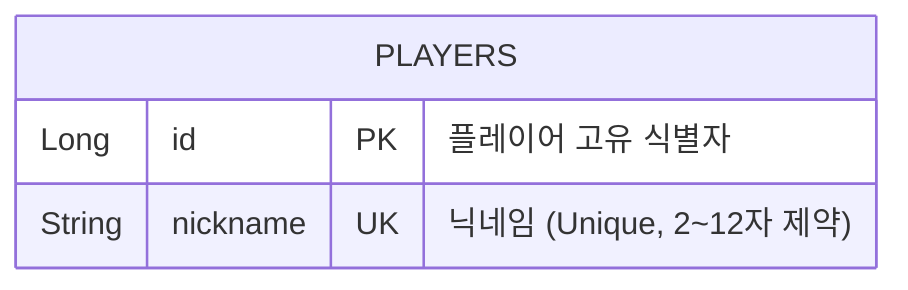
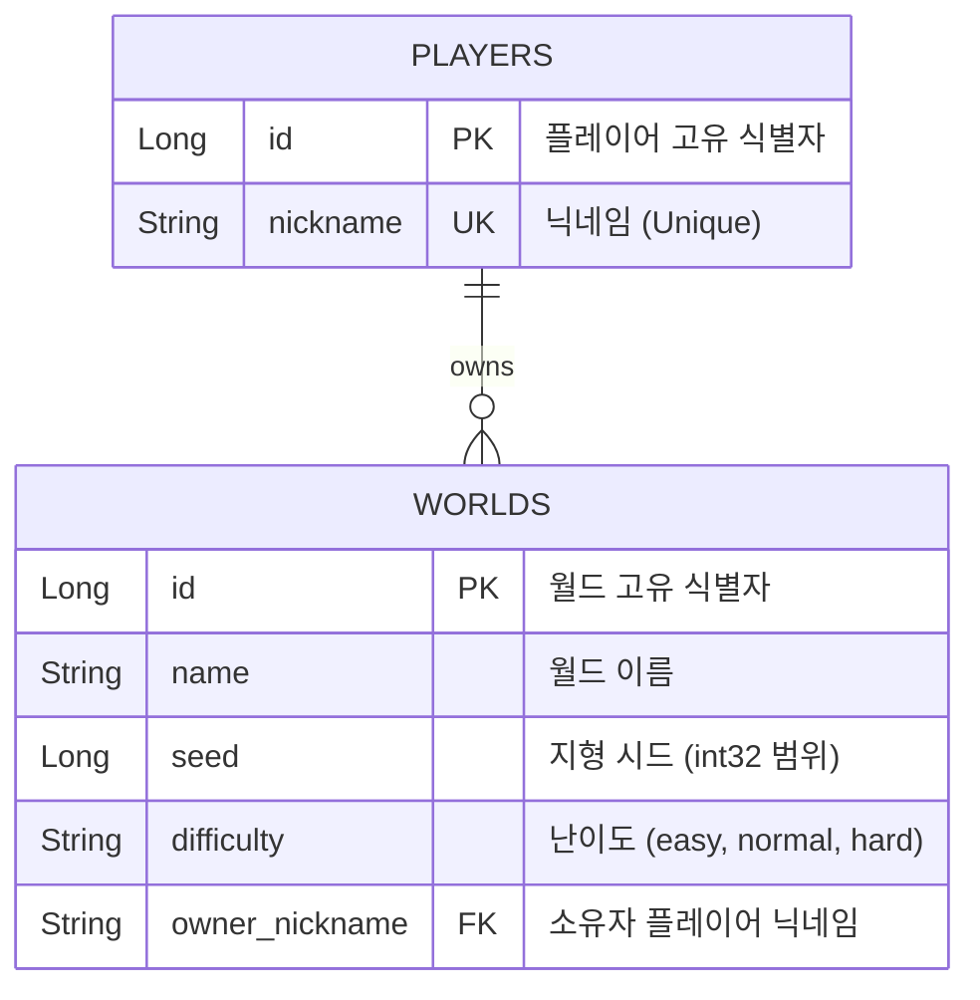
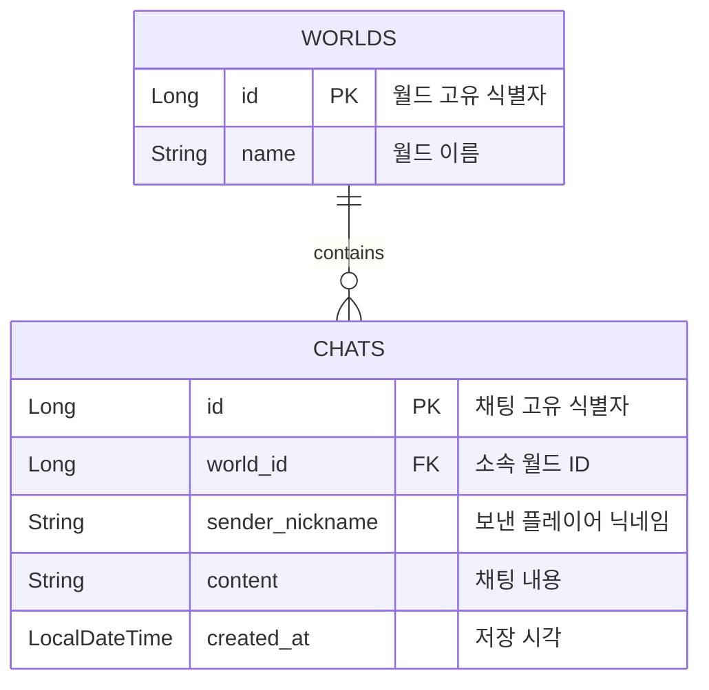
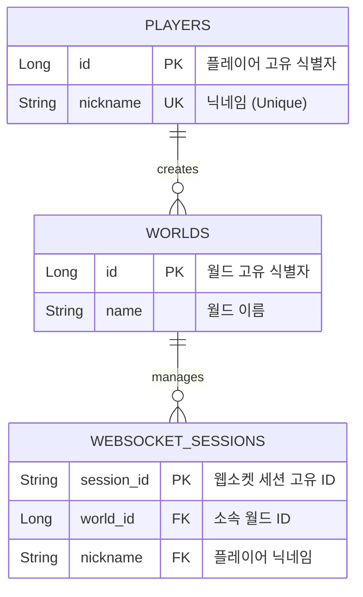

# [260916] 숙련 주차 프로젝트 발제 - WebCraft 실시간 게임 서버 구현
## 개요
- 'Docker' 환경으로 격리된 'MySQL' 데이터베이스에 모든 채팅 내역과 플레이어 데이터를 안전하게 저장하도록 연동
- 플레이어들이 여러 서버에 분산 접속하더라도 'Redis'를 통해 모든 채팅 메시지가 실시간으로 동기화되어 공유
- 'WebSocket' 방식을 통해 새로고침 없는 실시간 양방향 통신 시스템 구현

## 기술 스택
- **개발 언어 및 프레임워크:** Java 21, Spring Boot
- **데이터베이스:** MySQL (Docker)
- **캐싱 및 발행/구독:** Redis (Docker)
- **실시간 통신:** WebSocket

## 구현
### 1. 플레이어 등록 (Lv 3.)
#### 🗺️ ERD (데이터베이스 구조)



#### 📑 API 명세서
- **HTTP 메서드 / 경로:** `POST` `/players`
- **본문 형식 (Request Body):** `application/json`

| 필드명 | 타입 | 제약 조건 | 설명 |
| :--- | :--- | :--- | :--- |
| `nickname` | `string` | 2~12자, 필수 입력<br>정규식: `^[a-zA-Z0-9_]+$` | 영문 대소문자, 숫자, 밑줄(`_`)만 허용 (한글 불가) |

- **요청 데이터 예시**
```json
{
  "nickname": "steve"
}
```

- **응답 코드 목록 (Responses)**

| 상태 코드 (HTTP Status) | 설명 | 응답 본문 (Response Body) |
| :--- | :--- | :--- |
| **201 Created** | 플레이어 등록 완료 | 없음 (본문 비어있음) |
| **400 Bad Request** | 닉네임 유효성 규칙(2~12자, 정규식) 위반 | `{"error": "VALIDATION_FAILED"}` |
| **409 Conflict** | 이미 존재하는 닉네임 또는 동시 요청 충돌 발생 | `{"error": "DUPLICATE_NICKNAME"}` |

#### 🛠️ 주요 구현 특징
- **컨트롤러 검증:** `@Valid`와 `@RequestBody`를 조합하여 클라이언트가 보낸 JSON 데이터의 포맷과 정규식을 DTO 단에서 사전 검증
- **중복 처리 및 동시성 제어:** 조회를 통해 가입 여부를 먼저 체크, 같은 닉네임이 동시에 요청되어 조회 타이밍이 겹칠 경우의 예외 처리

---

### 2. 월드 조회 및 생성 (Lv 4.)
게임에 입장하기 위한 월드의 목록을 조회하고, 최대 개수 제한 내에서 새로운 월드를 생성하는 API

#### 🗺️ ERD (데이터베이스 구조)
- `WORLDS` 테이블은 월드 고유 정보 및 지형 시드, 난이도를 관리하며 생성자(`owner_nickname`) 정보를 포함



#### 📑 API 명세서
##### [1] 월드 목록 조회
- **HTTP 메서드 / 경로:** `GET` `/worlds`
- **응답 코드 목록 (Responses)**

| 상태 코드 | 설명 | 응답 본문 (Response Body 예시) |
| :--- | :--- | :--- |
| **200 OK** | 월드 목록 조회 성공 (최대 3개)<br>`onlineCount`는 Redis presence에서 실시간 조회 | `[{"id": 1, "name": "내 첫 월드", "seed": -173482, "onlineCount": 3, "difficulty": "normal"}]` |
| **503 Service** | 서버 기동 직후 월드 준비 완료 전 상태 | `{"error": "WORLD_BASELINE_INITIALIZING"}` |

##### [2] 월드 생성
- **HTTP 메서드 / 경로:** `POST` `/worlds`
- **본문 형식 (Request Body):** `application/json`

| 필드명 | 타입 | 제약 조건 | 설명 |
| :--- | :--- | :--- | :--- |
| `name` | `string` | 1~30자, 필수 입력<br>공백 문자열 불가 | 생성할 월드의 이름 |
| `difficulty` | `string` | 기본값: `"normal"`<br>Enum: `easy`, `normal`, `hard` | 월드 진행 난이도 |
| `nickname` | `string` | 2~12자, 선택 입력<br>등록된 플레이어 필수 | 월드를 생성하고 소유할 플레이어 닉네임 |

- **요청 데이터 예시 (Request Body Example)**
```json
{
  "name": "내 첫 월드",
  "difficulty": "normal",
  "nickname": "steve"
}
```

- **응답 코드 목록 (Responses)**

| 상태 코드 (HTTP Status) | 설명 | 응답 본문 (Response Body) |
| :--- | :--- | :--- |
| **201 Created** | 월드 생성 완료 (서버가 signed int32 시드 지정) | `{"id": 4, "name": "내 첫 월드", "seed": -173482, "difficulty": "normal", "ownerNickname": "steve"}` |
| **400 Bad Request** | 이름 규칙 위반(`VALIDATION_FAILED`) 또는 잘못된 포맷 | `{"error": "INVALID_REQUEST_BODY"}` |
| **404 Not Found** | 요청에 포함된 `nickname`이 가입되지 않은 플레이어임 | `{"error": "PLAYER_NOT_FOUND"}` |
| **409 Conflict** | 전체 생성된 월드가 이미 최대 상한선(3개)에 도달함 | `{"error": "WORLD_LIMIT_REACHED"}` |
| **503 Service** | 서버 기동 직후 월드 준비 완료 전 상태 | `{"error": "WORLD_BASELINE_INITIALIZING"}` |

#### 🛠️ 주요 구현 특징
- **원자성 보장:** 월드 생성 제한을 카운트하는 과정을 `worldOperations.duringCreation()` 람다 스코프 내부에 격리하여 트랜잭션 환경에서 실행
- **동시성 보장:** 트랜잭션 환경 내에서 `worldCreationGuard.lock()` 락을 걸어 동시성을 보장

---

### 3. 최근 채팅 조회 (Lv 5. ~ Lv 6.)
월드에 처음 들어갈 때 해당 월드의 최근 대화를 불러오는 API

#### 🗺️ ERD (데이터베이스 구조)



#### 📑 API 명세서
- **HTTP 메서드 / 경로:** `GET` `/worlds/{worldId}/chats`

| 파라미터 종류 | 필드명 | 타입 | 제약 조건 | 설명 |
| :--- | :--- | :--- | :--- | :--- |
| **Path** | `worldId` | `integer <int64>` | 필수 입력 | 월드의 고유 식별자<br>숫자가 아니면 400 VALIDATION_FAILED |
| **Query** | `limit` | `integer` | 기본값: `50`<br>선택 입력 | 가져올 최대 건수<br>1 미만이나 100 초과는 1~100으로 보정, 숫자가 아니면 400 |

- **응답 데이터 예시 (200 OK)**
```json
[
  {
    "sender": "steve",
    "content": "안녕하세요!",
    "createdAt": "2026-09-22T09:41:00"
  }
]
```

- **응답 코드 목록 (Responses)**

| 상태 코드 (HTTP Status) | 설명 | 응답 본문 (Response Body) |
| :--- | :--- | :--- |
| **200 OK** | 오래된 순서의 채팅 목록 반환 | `[{"sender": "string", "content": "string", "createdAt": "string"}]` |
| **400 Bad Request** | `worldId` 또는 `limit`이 숫자가 아님 | `{"error": "VALIDATION_FAILED"}` |
| **404 Not Found** | 요청에 포함된 `worldId`가 존재하지 않는 월드임 | `{"error": "WORLD_NOT_FOUND"}` |

#### 🛠️ 주요 구현 특징
- **최신순 정렬:** DB에서 최신 대화가 먼저 추출되도록 페이징(`PageRequest`) 조회를 수행, 반환 시 역정렬
- **성능 최적화:** 읽기 전용 트랜잭션(`@Transactional(readOnly = true)`)을 통해 조회 성능을 최적화하고 엔티티 변경 감지

---

### 4. WebSocket 연결 및 월드별 세션 관리 (Lv 7. ~ Lv 9.)
플레이어가 특정 월드에 진입하여 실시간 게임 환경에 참여할 수 있도록 웹소켓 연결을 수립하고, 월드별 클라이언트 세션을 관리

#### 🗺️ ERD (데이터베이스 구조)
- 웹소켓 연결 핸드셰이크 시점에 `PLAYERS` 및 `WORLDS` 테이블을 조회하여 실제 등록된 데이터인지 검증



#### 📑 API 명세서
- **연결 프로토콜 / 경로:** `ws://localhost:8080/ws/worlds/{worldId}?nickname={nickname}`
- **프레임 형식 (Message Type):** `Text (JSON String)`

| 파라미터 종류 | 필드명 | 타입 | 제약 조건 | 설명 |
| :--- | :--- | :--- | :--- | :--- |
| **Path** | `worldId` | `integer <int64>` | 필수 입력 | 입장할 월드의 고유 식별자 (월드 목록/생성 응답에서 받은 ID) |
| **Query** | `nickname` | `string` | 필수 입력 | `POST /players`로 사전에 등록한 플레이어의 닉네임 |

- **웹소켓 연결 상태 및 종료 코드 목록 (Handshake & Close Codes)**

| 상태/종료 코드 | 구분 | 발생 상황 및 설명 | 비고 / 처리 결과 |
| :--- | :--- | :--- | :--- |
| **101 Switching Protocols** | HTTP Status | 핸드셰이크 성공 및 웹소켓 커넥션 수립 완료 | 전이중 실시간 양방향 통신 시작 |
| **403 Forbidden** | HTTP Status | 허용되지 않은 오리진(Origin)으로부터의 접근 요청 | 핸드셰이크 단계에서 즉시 거절 |
| **503 Service Unavailable** | HTTP Status | 서버가 가동 직후이며 아직 월드 준비가 완료되지 않은 상태 | 핸드셰이크 단계에서 즉시 거절 |
| **4000** | Close Code | `nickname` 파라미터가 누락되었거나 가입되지 않은 플레이어인 경우 | 연결 수립 직후 세션 강제 해제 |
| **4001** | Close Code | 해당 `worldId`가 존재하지 않거나 접속할 수 없는 월드인 경우 | 연결 수립 직후 세션 강제 해제 |
| **4002** | Close Code | 동일 월드 내에 동일 닉네임을 사용하는 세션이 이미 존재할 경우 | 새로운 연결만 즉시 해제 (기존 연결 유지) |
| **1000** | Close Code | 정상적인 클라이언트의 퇴장 또는 서버 종료로 인한 해제 | 정상 종료 처리 |

#### 🛠️ 주요 구현 특징
- **핸드셰이크 인터셉터를 통한 사용자 식별:** 웹소켓 연결 수립 전(`beforeHandshake`) URL 경로 변수(`worldId`)와 쿼리 파라미터(`nickname`)를 추출하고, 검증된 정보를 세션의 독립된 속성 공간(`attributes`)에 `ATTR_NICKNAME`, `ATTR_WORLD_ID` 키로 바인딩하여 세션 단위 분기 처리가 가능하도록 인프라 구축
- **인터셉터 등록:** `@EnableWebSocket` 환경 하에서 지정된 경로(`/ws/worlds/{worldId}`)에 핸들러와 구현된 인터셉터를 등록하고, 보안 처리를 위한 CORS 허용 패턴(`setAllowedOriginPatterns`) 적용
- **월드별 세션 관리:** 다중 스레드 환경에서 안전하도록 `ConcurrentHashMap`과 계층적 구조(`Map<Long, ConcurrentHashMap<String, Entry>>`)를 사용, 월드 입장 시 `putIfAbsent` 원자적 연산을 활용해 중복 자원 등록을 방지

---

### 5. Redis 접속 상태 관리 및 메시지 라우팅 (Lv 10. ~ Lv 11.)
월드 내 실시간 접속자 수를 정확하게 동적 관리하기 위해 `Redis` 기반 시스템을 구축하고, 웹소켓으로 수신된 메시지를 타입별 핸들러로 분기 및 주기적인 연결 확인(`Ping/Pong`)을 처리

#### 📑 API 및 메시지 명세서
- **연결 프로토콜 / 방식:** WebSocket 내 텍스트 프레임 통신 (`Text Message`)
- **프레임 데이터 형식:** `application/json`

##### 클라이언트 송신 메시지 (Client To Server)
- **Ping 메시지 (연결 유지 및 갱신 요청)**
```json
{
  "type": "ping"
}
```

##### 서버 수신 데이터 제약 조건

| 필드명 | 타입 | 제약 조건 | 설명 |
| :--- | :--- | :--- | :--- |
| `type` | `string` | 필수 입력<br>정밀 매핑 조건 | 메시지의 종류를 구분하는 식별자<br>핸들러 라우팅의 기준값 (예: `"ping"`) |

##### 서버 응답 및 예외 코드 목록 (Responses & Errors)

| 메시지 타입 / 에러 코드 | 구분 | 설명 / 처리 결과 | 비고 |
| :--- | :--- | :--- | :--- |
| `{"type":"pong"}` | 정상 응답 | 클라이언트의 Ping 요청에 대해 즉각적인 회신 프레임 반환 | 세션 및 Redis 수명 연장 성공 |
| `INVALID_JSON` | 에러 응답 | 수신된 페이로드의 포맷이 유효한 JSON 구조가 아님 | 즉시 에러 프레임 전달 |
| `INVALID_MESSAGE` | 에러 응답 | JSON 데이터 구조가 오브젝트가 아니거나 내부 명세 규칙 위반 | 즉시 에러 프레임 전달 |
| `UNKNOWN_TYPE` | 에러 응답 | 수신된 `type`을 처리할 수 있는 라우팅 핸들러가 존재하지 않음 | 즉시 에러 프레임 전달 |
| `QUEUE_FULL` | 에러 응답 | 메시지 처리를 위한 내부 액션 큐 용량 상한 초과 발생 | `ActionQueueOverflowException` 발생 시 |

#### 🛠️ 주요 구현 특징
- **Redis 기반 실시간 동시 접속 관리:** Redis의 `Sorted Set` 자료구조를 활용하며, 각 연결 세션에 만료 시간을 부여하여 실시간 동시 접속자 수를 관리
- **하트비트(`Heartbeat`) 및 연결 갱신:** 클라이언트가 주기적으로 보내는 Ping 메시지를 감지하여 세션의 생존 상태를 확인하고, Redis의 접속 유효 기간을 동적으로 연장한 뒤 즉시 Pong으로 응답
- **메시지 라우팅 시스템:** 웹소켓으로 수신된 텍스트 데이터를 JSON 객체로 파싱한 후, `type` 필드값에 맞춰 사전에 등록된 전용 핸들러로 요청을 자동 분기 및 매핑
